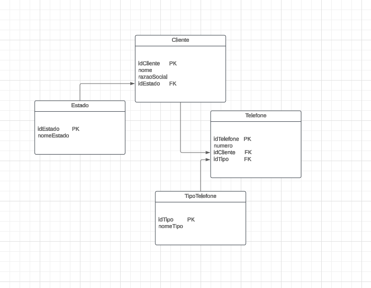

## 1 e 3 estão no arquivo script.js
## 2-
a- 1, 3, 5, 7, _9_
b- 2, 4, 8, 16, 32, 64, _128_
c- 0, 1, 4, 9, 16, 25, 36, _49_
d- 4, 16, 36, 64, _100_
e- 1, 1, 2, 3, 5, 8, _13_
f- 2,10, 12, 16, 17, 18, 19, _20_

## 4- 


``` bash
SELECT 
    c.idCliente, 
    c.nome, 
    c.razaoSocial, 
    t.numero,
    tt.nomeTipo AS tipoTelefone
FROM 
    Cliente c,
JOIN 
    Telefone t ON c.idCliente = t.idCliente
JOIN 
    TipoTelefone tt ON t.idTipo = tt.idTipo
JOIN 
    Estado e ON c.idEstado = e.idEstado
WHERE 
    e.nomeEstado = 'SP';
```

## 5-
Quando eles se cruzarem no percurso, ou seja, estiverem no mesmo ponto, ambos estarão a mesma distância de Ribeirão Preto.